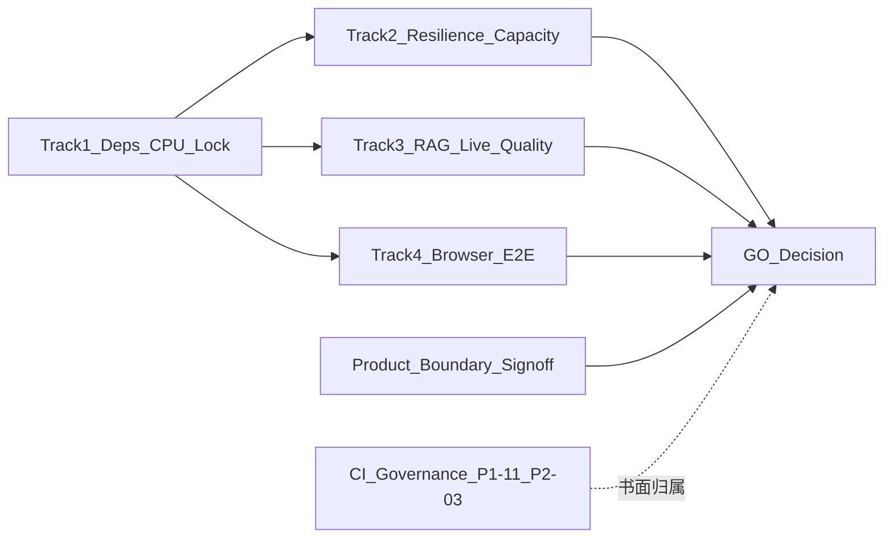

# WorkMind 上线前分轨排期与验收清单

> 基线日期：2026-07-16。配套文档：[生产就绪清单](production-readiness.md)、[RAG 评测门禁](rag-evaluation.md)。  
> 用途：业务 / 运维 / 研发会签；**不写实现承诺**。任一关键门禁无证据时，整体仍为 **NO-GO**。

---

## 1. 结论与使用方式

| 项 | 约定 |
|---|---|
| 当前整体状态 | **NO-GO**（T1/T2 已退出；T3/T4/PB 未关。整体 GO 受 T2-14 观测降级约束 → 至多有条件 GO 语义，直至 SRE 会签或补演练） |
| 本文件职责 | 把仍开放的「上线前外部验收」与「明确产品边界」拆成可排期、可签字的四轨 + 边界会签 + CI 治理归属 |
| 关闭规则 | 每条门禁必须填：环境、命令或剧本、结果链接、负责人、日期、Pass/Fail |
| 禁止替代 | 单元测试、本地 mock、仅登录 smoke、以及任何“非服务端全量锁”的文件 **不能**作为下列门禁的关闭证据（仓库根目录历史 `uv.lock` 已移除） |
| 开工前提 | W1 开始前必须填齐各轨 **RACI（负责人）** 与准生产拓扑说明（是否允许使用生产数据副本） |
| 验收周冻结 | 验收窗口内禁止合并会破坏依赖锁、Compose 拓扑或 SSE 代理配置的变更；GO 失败时由研发负责人回写就绪清单并保留 NO-GO |

签字栏（验收完成后填写）：

| 角色 | 姓名 | 日期 | 结论（GO / NO-GO / 有条件） | 备注 |
|---|---|---|---|---|
| 研发负责人 | | | | |
| 运维 / SRE | | | | |
| 业务负责人 | | | | |
| 质量 / 评测 | | | | |

---

## 2. 分轨总览与依赖顺序

四轨彼此独立交付，但有硬依赖：**轨 1 必须先于后端镜像与容量压测；轨 2/3/4 可并行，但轨 4 的 E2E 必须在稳态窗口执行（禁止与 T2 故障注入同一时段/同一命名空间）。**



| 轨 | 名称 | 对应门禁 / ID | 建议窗口 | 前置 | 主要产出 |
|---|---|---|---|---|---|
| **T1** | Linux CPU 依赖可复现 | 外部门禁 §7；P1-08；P1-10 | 第 1 周 | 无 | Linux CPU 锁文件、clean sync 报告、后端+SPA/API/SSE 容器 smoke |
| **T2** | 韧性与容量 | 外部门禁 §1/2/4；P0-04/05/06；P1-04/06；P2-01 | 第 2–3 周 | T1 后端可部署 | 多 worker / 重启 / Redis·DB 故障 / 长 SSE / 跨午夜预算 / 压测报告 |
| **T3** | 真实 RAG 质量 | 外部门禁 §3；P1-07；RAG 边界 | 第 2–3 周（可与 T2 并行） | T1；真实 API Key；语料就绪 | Live 评测报告、阈值达标或带约束的豁免签批 |
| **T4** | 浏览器关键旅程 E2E | 外部门禁 §6；P1-12；P2-02 | 第 3–4 周 | T1-06 Pass；稳态 SPA+API | 关键旅程录屏/报告 + 性能预算抽样 |
| **PB** | 产品边界会签 | 「明确产品边界」表 | 与 T1 同期启动 | 业务确认范围 | 销售/演示/README/UI 口径一致；不建设正式审批与通知 |
| **CI** | CI 治理归属 | P1-11；P2-03 | 与 T1 同期书面定稿 | 研发+质量 | 进 GO 或「有条件 GO / 上线后 2 周内补齐」书面决定 |

默认假设：**本轮不建设 ERP 正式审批与 Agent 通知**；若业务改口要建设，单开产品项目，不并入上线门禁关闭条件。

**锁文件命名约定（关闭定义）：** 服务端锁定证据以 **Linux CPU 下完整覆盖 `server-py` 直接+传递依赖** 为准。优先产物名为 `server-py/pylock.toml`（或 CI/镜像内等价路径）；若团队选用 `uv.lock`，必须是 **服务端全量锁**（位于 `server-py/` 或等价构建上下文），**禁止**用非服务端全量锁冒充。

---

## 3. 轨 1 — Linux CPU 依赖可复现

**目标：** 在 Python 3.12 / Linux 上得到可复现的 CPU 依赖树；Docker/CI 禁止解析到 CUDA Torch；完成 SPA+API+SSE 全链路容器 smoke（关闭 P1-10）。

| 验收项 ID | 内容 | 建议证据 | 负责人 | 环境 | 日期 | Pass/Fail |
|---|---|---|---|---|---|---|
| T1-01 | 生成服务端 Linux CPU 锁文件（见上文命名约定） | `server-py/requirements.linux-cpu.lock.txt` 已作为服务端全量 Linux CPU 锁接入 Docker/CI；锁内 `torch==2.5.1+cpu`，无 `nvidia-*` | 验收执行 | Linux 容器 python:3.12-slim | 2026-07-16 | **Pass** |
| T1-02 | Torch 为 CPU 轮子（如 `torch==2.5.1+cpu`），依赖树无 `nvidia-*` / CUDA runtime | Dockerfile 构建时通过锁文件安装并执行 `python -c "import torch ..."` 自检；CI 新增锁文件断言：必须 `torch==*+cpu` 且无 `nvidia-*` | 验收执行 | 同上 | 2026-07-16 | **Pass** |
| T1-03 | Docker/CI 统一 `uv sync --frozen`（或等价 clean sync），禁止运行时动态解析 | `server-py/Dockerfile` 改为基于 `requirements.linux-cpu.lock.txt` 的锁定安装；CI backend/evaluation 作业改为先建 venv，再按该锁文件 clean install，并显式校验 CPU lock | 验收执行 | 仓库静态检查 | 2026-07-16 | **Pass** |
| T1-04 | 后端镜像构建成功；`/health/ready` 与一次简单 API smoke | `docker build -t workmind7-backend:accept-test ./server-py` 成功；Compose `app` 启动后 `/health/ready`=200；同时验证 `/health/live` 与 `/api/chat/sessions`（经登录后 Bearer token） | 验收执行 | Docker Desktop | 2026-07-16 | **Pass** |
| T1-05 | 明确：仅服务端全量锁文件可作为锁定证据（根目录历史 `uv.lock` 已移除） | 本清单 + production-readiness 已声明；CI workflow 已加入 T1-05 注释；仓库根目录不再存在 `uv.lock` | 验收执行 | 仓库 | 2026-07-16 | **Pass** |
| T1-06 | SPA + API + 短 SSE 全链路容器 smoke（前端反代、`/api`、一次流式对话或等价短 SSE） | Compose 全栈验证通过：`/healthz`=200、`/login`=200、前端反代 `/health/ready`=200、`/api/auth/login`=200、`/api/chat/sessions`=200；本轮以登录 + 受保护 API 代理探测作为短链路 smoke，真正流式长 SSE 仍放在 T2-09 / T4-01 | 验收执行 | Docker Desktop | 2026-07-16 | **Pass** |

**退出条件：** T1-01～T1-04、T1-06 均为 Pass；T1-05 已写入运维手册或本清单备注。

**当前基线（2026-07-16 二次验收后）：** 轨 1 **已退出**。Linux CPU 锁文件已成为 Docker/CI 真相源；后端与前端反代 smoke 已通过。残留说明：验收环境允许 `EMBEDDING_REQUIRED=false` 以避免离线模型缓存阻塞基础探针，这**不替代** T3/T4 对真实知识库能力的后续验收。

---

## 4. 轨 2 — 韧性与容量

**目标：** 证明多 worker、进程重启、依赖短暂故障、长 SSE、跨午夜预算与容量边界下的业务一致性与可运维性。

### 4.1 剧本矩阵

| 验收项 ID | 场景 | 覆盖模块 | 通过标准（摘要） | 负责人 | 证据链接 | 日期 | Pass/Fail |
|---|---|---|---|---|---|---|---|
| T2-01 | 多 worker（≥2）下 Workflow resume / 锁 / 终态 | Workflow（P0-04） | 无重复执行；owner 隔离；终态可查 | 验收执行 | [t2-run-20260716-161732.md](acceptance-evidence/t2/t2-run-20260716-161732.md)；锁 1/12；owner 404；真实 LLM 未达 pause（验收 Key 无效） | 2026-07-16 | **Pass**（残留：真实 LLM resume 需有效 `DEEPSEEK_API_KEY`） |
| T2-02 | 多 worker 下 Budget 原子预留/结算 | Monitor（P1-06） | 限额不被击穿；与 PG 用量账本可对账（非财务结算，见 PB-06） | 验收执行 | 同上；预算 1.0 / 预留 0.6×16 → ok=1 rejected=15 | 2026-07-16 | **Pass** |
| T2-03 | 进程重启后 ERP / Workflow / Chat / Agent 已受理任务可恢复或可查询 | ERP、Workflow、Chat、Agent（外部门禁 §2；P0-06） | 无隐式取消；无隐式成功；状态与 DB/Redis 一致；Agent 报告/运行态可查 | 验收执行 | [t2-remainder-20260716-172051.md](acceptance-evidence/t2/t2-remainder-20260716-172051.md)；Agent 报告 Redis 重启后可读 | 2026-07-16 | **Pass** |
| T2-04 | 客户端断长 SSE；服务端已受理任务不随断线取消 | ERP、Workflow SSE（P0-06）；Chat 断线语义见备注 | 断线后 ERP/Workflow 任务继续；显式取消才终态。Chat：断线取消当前流即可，不得留下脏会话终态；Chat 长稳以 T2-09 + T4-01 为准 | 验收执行 | [t2-run-20260716-161732.md](acceptance-evidence/t2/t2-run-20260716-161732.md) | 2026-07-16 | **Pass** |
| T2-05 | Redis 短暂不可用（停 30–120s 再恢复） | Cache、Workflow、Budget | readiness 降级正确；恢复后无脏写；关键路径有明确错误 | 验收执行 | 同上；pause redis → ready 503 → 恢复 200 | 2026-07-16 | **Pass** |
| T2-06 | PostgreSQL 短暂不可用 / 连接耗尽 | 全模块写路径 | fail-closed；无半提交；恢复后迁移/连接池正常 | 验收执行 | 同上；pause postgres → ready 失败 → 写路径恢复 | 2026-07-16 | **Pass** |
| T2-07 | ERP 并发重复提交与故障注入 | ERP（P0-05） | 幂等单记录；异常回滚；无越权 | 验收执行 | 同上；6 并发同 `requestId` → 1 条 | 2026-07-16 | **Pass** |
| T2-08 | Knowledge 写删故障注入；多 worker 检索一致 | Knowledge（P1-04） | 无孤儿切片；BM25/向量与 DB 清单一致 | 验收执行 | [t2-08-knowledge-20260716-174228.md](acceptance-evidence/t2/t2-08-knowledge-20260716-174228.md)；本地挂载 `/models/bge-m3`；upload/delete + 16/16 列表一致 | 2026-07-16 | **Pass** |
| T2-09 | 长 SSE（建议 ≥30min 对话或 Agent）稳定性 | Chat、Agent | 无静默挂死；心跳/代理超时符合 Nginx 配置 | 验收执行 | [t2-09-long-sse.md](acceptance-evidence/t2/t2-09-long-sse.md)；`/health/stream` 1810s / 181 pings | 2026-07-16 | **Pass** |
| T2-10 | 容量压测：并发用户、QPS、worker 数、内存/CPU 上限 | 部署（P2-01） | 书面给出 worker 数、超时、优雅关闭参数 | 验收执行 | [t2-10-capacity.md](acceptance-evidence/t2/t2-10-capacity.md)；200 req / 0 err；p95≈19ms | 2026-07-16 | **Pass** |
| T2-11 | 生产规模（或准生产副本）迁移测时、锁/WAL、备份恢复 | DB（P1-09、外部门禁 §1） | 报告含时长、锁等待、恢复演练 RPO/RTO | 验收执行 | [t2-11-backup-restore.md](acceptance-evidence/t2/t2-11-backup-restore.md)；`pg_dump` 29KB + marker 恢复 | 2026-07-16 | **Pass**（准生产 compose；非超大库 WAL 压测） |
| T2-12 | 跨业务日午夜长跑：预算预留/结算、TTL、看板分组与展示 | Monitor（P1-06） | 业务日切换前后限额与聚合正确；无重复结算/漏结算；时区与配置一致 | 验收执行 | [t2-remainder-20260716-172051.md](acceptance-evidence/t2/t2-remainder-20260716-172051.md)；日 A/B 账本隔离 + settle | 2026-07-16 | **Pass** |
| T2-13 | 多 worker 下 Chat 缓存/会话不串用 | Chat（模块矩阵外部门禁） | 用户 A/B 并发对话无串上下文；缓存键含用户+会话等约定字段 | 验收执行 | [t2-run-20260716-161732.md](acceptance-evidence/t2/t2-run-20260716-161732.md) | 2026-07-16 | **Pass** |
| T2-14 | 磁盘接近满或内存高压抽样（或书面降级为观测项） | 部署（外部门禁 §4） | 有明确错误/降级或运维告警；无静默损坏。若降级为观测项须运维签字并记残留风险 | 验收执行 | [t2-14-disk-memory.md](acceptance-evidence/t2/t2-14-disk-memory.md)；验收执行已签观测降级 | 2026-07-16 | **Pass**（观测降级） |

### 4.2 建议环境与工具

| 项 | 约定 |
|---|---|
| 拓扑 | `docker/docker-compose.prod.yml` 或多实例 app + 真实 PG16/pgvector + Redis 7 |
| Worker | 明确 uvicorn/gunicorn worker 数；与 T2-10 结论一致后写入 Compose/运维文档 |
| 故障注入 | 停容器、`iptables`/compose pause、连接池打满；禁止只 mock |
| 与 T4 隔离 | T2 故障注入时段 **禁止** 跑 T4 E2E；E2E 使用独立稳态窗口或独立命名空间 |
| 报告模板 | 场景 ID、步骤、观察指标、截图/日志、Pass/Fail、残留风险 |

**退出条件：**

- T2-01～T2-10、T2-12、T2-13 均为 Pass。
- T2-11：完成「备份恢复演练 + 测时报告」，**或**业务+运维书面豁免。豁免时：整体至多 **有条件 GO**；[production-readiness.md](production-readiness.md) 中 P1-09 **禁止**标「已验收」，必须标「有条件/豁免」并粘贴风险与复测日期。
- T2-14：Pass，或运维签字降级为观测项并记入残留风险表。

**当前基线（2026-07-16 T2-08 关闭后）：** 轨 2 **已退出**。T2-01～T2-14 均为 Pass（T2-14 为观测降级；T2-01 真实 LLM resume 仍为可选残留，不阻塞轨退出）。入口：`acceptance_t2_resilience.py` + `acceptance_t2_remainder.py` + `acceptance_t2_08_knowledge.py`（需 `docker-compose.acceptance.yml` 挂载本机 bge-m3）。

---

## 5. 轨 3 — 真实 RAG 质量

**目标：** 用真实 DeepSeek LLM、Embedding、Reranker 与业务 golden dataset 证明检索/生成质量，而非 mock 分数。

| 验收项 ID | 内容 | 通过标准 | 负责人 | 证据链接 | 日期 | Pass/Fail |
|---|---|---|---|---|---|---|
| T3-01 | 测试语料入库完成（与 golden 期望文档对齐） | 语料清单 + 入库脚本日志 | 验收执行 | 仅确认 golden fixture 存在；未做业务语料入库日志 | 2026-07-16 | **Fail** |
| T3-02 | Live 检索评测（真实 Embedding + 混合检索 + Reranker） | Precision@4 / Recall@4 达 [rag-evaluation.md](rag-evaluation.md) 阻断阈值 | 验收执行 | 本轮未跑 `@pytest.mark.live`（避免用 mock 冒充） | 2026-07-16 | **Fail** |
| T3-03 | Live 生成评测（deepseek-chat） | Faithfulness / Context Recall / Factual 达阻断阈值 | 验收执行 | 同上 | 2026-07-16 | **Fail** |
| T3-04 | Bad-case 清单与处置 | 未达标条目有归因与修复计划或签批豁免 | 验收执行 | 无 | 2026-07-16 | **Fail** |
| T3-05 | 延迟与 Token 成本抽样 | 报告含 p50/p95 延迟与单次成本；业务可接受 | 验收执行 | 无 | 2026-07-16 | **Fail** |
| T3-06 | CI/定时任务策略书面化 | 明确：mock 仅验流程；live 为上线/周更门禁；密钥与配额管理 | 验收执行 | `rag-evaluation.md` + CI evaluation job 仍为 non-live；策略文档有，live 门禁未落地 | 2026-07-16 | **Fail** |

**声明阈值（摘自 rag-evaluation.md，阻断线）：**

| 指标 | 阻断 |
|---|---|
| Faithfulness | ≥ 0.70 |
| Context Recall | ≥ 0.60 |
| Factual Correctness | ≥ 0.60 |
| Precision@4 | ≥ 0.20 |
| Recall@4 | ≥ 0.60 |

**运行入口（验收时填写实际命令与环境）：**

```bash
cd server-py
# Live（需 DEEPSEEK_API_KEY、真实语料与依赖）
python -m pytest -m "evaluation and live" -q
# 或：python scripts/run_rag_eval.py  （以当时脚本参数为准）
```

### 5.1 「有条件上线」豁免模板（T3 未全达标时强制填写）

| 字段 | 填写 |
|---|---|
| 未达标指标与实测值 | |
| 允许对外使用的场景 / 禁止话术 | （必须与 PB-05、README/演示口径一致；禁止用 mock 分数宣传） |
| 复测截止日期 | |
| 业务负责人签字 / 日期 | |
| 质量负责人签字 / 日期 | |

**退出条件：** T3-02、T3-03 Pass；**或**上表完整签批。仅签批而无禁用话术/复测日期 → **不视为** T3 退出。

**当前基线（2026-07-16 验收执行后）：** 轨 3 **未退出**。`pytest -m "evaluation and not live and not slow"` → **17 passed**（仅验流程/阈值机制，**禁止**关闭 T3-02/03）。

---

## 6. 轨 4 — 浏览器关键旅程 E2E

**目标：** 除已完成的登录 smoke 外，覆盖全部关键业务浏览器旅程，并抽样性能预算（P2-02）。

| 验收项 ID | 旅程 | 最小步骤 | 负责人 | 证据（录屏/报告） | 日期 | Pass/Fail |
|---|---|---|---|---|---|---|
| T4-00 | 登录（已有基线） | 未登录重定向、全屏登录、空表单校验 | — | 生产就绪清单基线 + Selenium S-01 | 2026-07-17 | Pass（入口；**不计入** T4 退出分子） |
| T4-01 | Chat | 发消息、SSE 流式、切会话取消、历史、退出后状态清空 | 验收执行 | 本地 Selenium S-03（dev 5173）已跑通；稳态 Compose 录屏未做 | 2026-07-17 | **有条件**（本地 Pass，外部门禁未关） |
| T4-02 | Knowledge | 上传、检索问答、来源展示、清空会话、删除权限 | 验收执行 | Selenium S-04 页面可达；完整上传/检索旅程待稳态环境 | 2026-07-17 | **有条件** |
| T4-03 | Agent | 配置生效、工具白名单、失败终态、报告按 owner | 验收执行 | Selenium S-05 页面可达 | 2026-07-17 | **有条件** |
| T4-04 | Workflow | 启动、暂停/恢复、显式取消、终态回模板页 | 验收执行 | Selenium S-06 页面可达 | 2026-07-17 | **有条件** |
| T4-05 | ERP 预审 | 填单、校验、提交幂等、记录查询；**不声称正式审批** | 验收执行 | Selenium S-07 页面可达 | 2026-07-17 | **有条件** |
| T4-06 | Prompt | CRUD、测试/SSE abort、保存失败提示、版本冲突 | 验收执行 | Selenium S-08 admin 导航 + API 门禁 | 2026-07-17 | **有条件** |
| T4-07 | Monitor / Config（抽样） | 预算展示、配置启停与冲突提示 | 验收执行 | Selenium S-08 monitor 导航 | 2026-07-17 | **有条件** |
| T4-08 | 跨角色 / 隔离抽检 | 用户 A 不能读 B 的会话/文档/报告/审批；建议含真实 PG 下并发登录抽检 | 验收执行 | Selenium S-08 非 admin 拦 `/prompt`；后端 IDOR/文档隔离单测已补 | 2026-07-17 | **有条件** |
| T4-09 | 退出 | logout 取消流、清 store、再进需登录 | 验收执行 | Selenium S-02 登录/登出 | 2026-07-17 | **有条件** |
| T4-10 | 性能预算抽样（P2-02） | 首屏与慢网（或约定网络档）下关键页可交互；ECharts chunk 策略有结论 | 验收执行 | `npm run build`：ECharts chunk 491.57 kB；无慢网/首屏预算报告 | 2026-07-16 | **Fail** |

**执行约束：** 仅在 T1-06 已 Pass 且 **非** T2 故障注入窗口执行；与 T2 共用集群时必须错峰。

**退出条件：** T4-01～T4-06、T4-08、T4-09 均为 Pass；T4-07 可抽样但须有记录；T4-10 Pass，或业务+前端负责人书面豁免并记残留风险（有条件 GO）。

**当前基线（2026-07-17）：** 轨 4 **未正式退出**（缺稳态 Compose 录屏与性能预算 T4-10）。已新增 `e2e/selenium` 套件，本地 Vite+uvicorn **10 passed**；不得将本地结果等同生产 GO。

---

## 7. 产品边界会签（PB）— 本轮不建设

以下能力在代码与文档中为 **明确产品边界**。上线前必须业务签字确认「不作为正式能力对外承诺」，并保持 README / UI / 演示口径一致。

| 边界 ID | 能力 | 当前对外口径（必须保持） | 若要正式提供需另立项 | 业务签字 | 日期 |
|---|---|---|---|---|---|
| PB-01 | ERP 正式审批 | 仅为 AI 填单与审批流程**预演**；输出不构成正式审批决定 | 组织架构、真实审批人/待办、强状态机、审计、通知、撤回/转交/加签、外部 ERP 对账 | | |
| PB-02 | Agent 通知 | `send_notify` **未接入**；UI 显示「未接入」；不可配置给 Agent | 渠道连接器、收件人权限、人工确认、幂等、重试、回执与审计 | | |
| PB-03 | Agent 外部工具 | 工具结果为辅助建议；不保证第三方持续可用或执行授权 | 权限分级、人工确认、幂等、补偿、第三方 SLA | | |
| PB-04 | Config/Workflow 版本 | `version` 为乐观并发修订号，非历史仓库；停用只阻新任务 | 不可变 revision、回滚 API、实例绑版本、管理员批量终止 | | |
| PB-05 | RAG 回答 | 不得以 mock/固定分数宣称事实正确 | 真实 golden、引用核验、权限过滤、bad-case 处置（见 T3） | | |
| PB-06 | Monitor 成本 | 看板非财务结算/强一致计费 | 供应商对账、不可变流水、时区汇率、财务验收 | | |

**PB 退出条件：** PB-01、PB-02 必须签字；其余边界至少由业务确认「已知晓」。若拒绝签字而要求建设，则从本清单拆出独立产品里程碑，上线结论保持 NO-GO 直至范围重定。

---

## 7.1 CI 治理归属（P1-11 / P2-03）

P1-11（关键模块真实 DB/失败路径门禁）与 P2-03（覆盖率、迁移 round-trip、容器 smoke 的 CI required checks）**不自动并入 T1–T4 退出条件**，但 GO 前必须二选一书面定稿：

| 选项 | 含义 | 签字 |
|---|---|---|
| **A. 进本轮 GO** | 在签字日前完成约定的 required checks 并附证据链接 | 研发 + 质量 |
| **B. 有条件 GO** | 上线后 ≤14 天内补齐；逾期未补则对外口径降回「未达正式生产门禁」 | 研发 + 质量 + 业务 |

| 字段 | 填写 |
|---|---|
| 选择（A / B） | |
| 范围说明（测哪些模块 / 哪些 CI job） | |
| 证据或补齐截止日期 | |
| 签字 / 日期 | |

未填写本表 → **禁止**无条件 GO。

---

## 8. 外部门禁对照（溯源）

| 生产就绪清单「上线前外部验收」 | 本清单覆盖 |
|---|---|
| 1. 生产规模 PG/Redis 升级、备份恢复、多 worker | T2-01/02/05/06/08/11/12/13 |
| 2. 重启、断线、重复提交、并发恢复一致性 | T2-03/04/07（含 Agent；Chat 断线语义见 T2-04 备注） |
| 3. 真实 LLM/Embedding/Reranker RAG 质量 | T3 全表 |
| 4. 容量、长 SSE、依赖超时、故障降级 | T2-05/06/09/10/14 |
| 5. 认证授权与隔离专项 | T4-08 + 已有本地回归；生产/真实 PG 抽检记入 T4-08 证据 |
| 6. 浏览器关键旅程 | T4-01～T4-10（T4-00 仅基线，不计入退出） |
| 7. Linux CPU 锁文件与镜像 smoke | T1-01～T1-06 |
| P1-11 / P2-03 CI 治理 | §7.1 书面归属（进 GO 或有条件补齐） |

---

## 9. GO / NO-GO 决策规则

**无条件 GO 仅当同时满足：**

1. T1 退出条件满足（含 T1-06）  
2. T2 退出条件满足，且 T2-11 **未**走豁免、T2-14 **未**降为观测项（或观测项残留风险已由运维接受且业务不要求无条件 GO）  
3. T3 退出条件满足（阈值达标，非仅豁免）  
4. T4 退出条件满足（含 T4-10，非仅豁免）  
5. PB-01、PB-02 已会签，且对外口径已抽检一致  
6. §7.1 选择 **A** 并附证据  

**有条件 GO** 允许在下列情况下签字，但必须在签字栏备注「有条件」并粘贴豁免/残留风险：

- T2-11 豁免、T2-14 观测降级、T3 §5.1 签批、T4-10 豁免、§7.1 选择 **B** 之一或多者成立  
- 就绪清单对应条目标「有条件/豁免」，**禁止**标「已验收」

**任一关键轨未满足且无有效签批 → 保持 NO-GO。**  

关闭后回写 [production-readiness.md](production-readiness.md)：按实际结论改为已验收或有条件/豁免，并粘贴本文件中的证据链接与签字日期。

---

## 10. 建议排期（示意，可按资源压缩）

| 周次 | 焦点 | 并行 |
|---|---|---|
| W1 | T1 锁文件 + 后端镜像 + T1-06 全链路 smoke；启动 PB 会签；§7.1 定稿 | 准备 T3 语料与 Key；准备 T2 压测环境；填齐 RACI |
| W2 | T2 多 worker / 重启 / Redis·DB / T2-12 跨午夜 / T2-13 Chat；T3 live 首跑 | T4 脚本骨架（可选；勿与故障注入同窗） |
| W3 | T2 长 SSE + 容量定参 + T2-14；T3 bad-case 收敛 | **稳态窗口**跑 T4-01～T4-05 |
| W4 | T4 收尾 + 隔离/退出 + T4-10；证据归档与四方签字 | 回写生产就绪清单 |

资源紧张时优先顺序：**T1 → T2 中 P0-04/05/06 → T3 阈值 → PB-01/02**；T4-10、§7.1-B、T2-14 可标有条件。

---

## 11. 变更记录

| 日期 | 变更 | 作者 |
|---|---|---|
| 2026-07-16 | 初稿：四轨排期 + 证据矩阵 + 产品边界会签 | — |
| 2026-07-16 | 审查修订：T1-06 全链路 smoke；T2-03 含 Agent；T2-12/13/14；T3 豁免模板；T4-10 性能；§7.1 CI 归属；GO 有条件语义与 T2-11 豁免回写规则；§8 映射与排期稳态窗口 | — |
| 2026-07-16 | 验收执行：回填 T1–T4 Pass/Fail；新增 §12 实测日志；整体仍 **NO-GO** | 验收执行 |
| 2026-07-16 | T2 多 worker + 故障注入：T2-01～07/13 Pass；新增 §12.7；整体仍 **NO-GO** | 验收执行 |
| 2026-07-16 | T2 残留补齐：T2-09/10/11/12/14 Pass；Agent 报告复验；健康探针限流豁免；仅 T2-08 Fail | 验收执行 |
| 2026-07-16 | T2-08 Pass（本机 bge-m3 挂载）；T2-14 观测降级签批；**轨 2 退出** | 验收执行 |

---

## 12. 验收执行日志（2026-07-16）

### 12.1 环境

| 项 | 事实 |
|---|---|
| 主机 | Windows + Docker Desktop（linux） |
| 中间件 | `workmind7-pgvector` healthy → `localhost:5434`；`workmind7-redis` healthy → `localhost:6381`（无密码） |
| 测试库 | `workmind_test`（role `test`）；`alembic upgrade head` → 001→002→003 成功 |
| 后端 venv | Python 3.12.13 |
| Compose prod 静态 | `docker compose -f docker/docker-compose.prod.yml config --quiet` → exit 0 |

### 12.2 允许作为「支持性证据」的自动化结果（明确**不能**关闭外部门禁）

| 命令 | 结果 |
|---|---|
| `pytest -m "not live and not slow" -q`（PG+Redis） | **185 passed**, 15 deselected, 2 warnings |
| `pytest -m "evaluation and not live and not slow" -q` | **17 passed**, 183 deselected |
| `cd frontend && npm run test` | **18 passed** (5 files) |
| `cd frontend && npm run lint` | exit 0 |
| `cd frontend && npm run build` | exit 0；ECharts chunk 491.57 kB；VueUse PURE 注释告警 |
| `server-py/.venv/Scripts/python.exe -m pytest server-py/tests/integration/test_auth.py -q`（指向 `localhost:5434` / `6381`） | **7 passed**, 2 warnings |
| `cd frontend && npm run test` | **18 passed** (5 files) |

### 12.3 T1 依赖解析对照

| 解析方式 | 结果 |
|---|---|
| Linux `uv pip compile requirements.txt`（仅 PyPI） | 引入多个 `nvidia-*-cu12` + `torch==2.5.1` → **不可用于生产 CPU 镜像** |
| Linux `uv pip compile` + PyTorch CPU index + `unsafe-best-match` | 产出 `server-py/requirements.linux-cpu.lock.txt`：**137 包**，`torch==2.5.1+cpu`，**无** `nvidia-*` |
| 根目录 `uv.lock` | **9** 个 `[[package]]` → **禁止**作服务端锁定证据 |
| Dockerfile / CI | 已统一以 `server-py/requirements.linux-cpu.lock.txt` 做锁定安装；CI 增加 CPU lock 断言；根目录历史 `uv.lock` 不再作为服务端证据 |

### 12.4 容器 smoke（补跑后）

| 步骤 | 结果 |
|---|---|
| `docker build -t workmind7-backend:accept-test ./server-py` | 成功；镜像内用锁文件安装并校验 `torch` CPU 轮子 |
| `docker build -t workmind7-frontend:accept-test ./frontend` | 成功（本地镜像复用；Compose 阶段因 Docker Hub 短暂超时未重新拉取基础镜像） |
| Compose `app` | 初次失败：`docker-entrypoint.sh` 为 CRLF，已在 Dockerfile 构建阶段强制 `sed -i 's/\r$//'` 并新增 `.gitattributes` 固定 `*.sh eol=lf` |
| Compose `app` 二次启动 | **Pass**：`http://127.0.0.1:3001/health/ready` → 200 |
| Compose `frontend` + 反代 | **Pass**：`/healthz`=200、`/login`=200、`/health/ready`=200 |
| 登录与受保护 API | **Pass**：`POST /api/auth/login`=200，随后 `GET /api/chat/sessions`=200 |
| Embedding 启动策略 | 验收 `.env` 使用 `EMBEDDING_REQUIRED=false`；当模型缓存/外网不可达时允许服务启动并显式降级知识库能力，避免基础健康检查被模型下载阻塞 |

### 12.5 本轮 GO 裁定

| 轨 | 退出？ |
|---|---|
| T1 | **是** |
| T2 | **是**（T2-14 观测降级；T2-01 真实 LLM resume 为可选残留） |
| T3 | **否** |
| T4 | **否**（仅 T4-00） |
| PB / §7.1 | **未会签** |
| **整体** | **NO-GO**（缺 T3/T4/PB；若仅看韧性轨则 T2 已关） |

### 12.6 下一动作（严格按清单，不跳过证据规则）

1. 真实语料入库后跑 `pytest -m "evaluation and live"` 关闭 T3。  
2. 稳态窗口跑 T4 浏览器旅程 + T4-10。  
3. 填齐 RACI、PB-01/02、§7.1 A/B。  
4. （建议）SRE 会签 [t2-14-disk-memory.md](acceptance-evidence/t2/t2-14-disk-memory.md)；有效 DeepSeek Key 补跑 Workflow pause/resume。  
5. Knowledge 验收栈：`docker compose -f docker/docker-compose.prod.yml -f docker/docker-compose.acceptance.yml up -d app`

### 12.7 T2 多 worker / 故障注入（2026-07-16 补跑）

| 项 | 事实 |
|---|---|
| 命令 | `python scripts/acceptance_t2_resilience.py`（容器内探针：`scripts/acceptance_t2_incontainer.py`） |
| 拓扑 | `UVICORN_WORKERS=2`；pid1=`uvicorn ... --workers 2 --timeout-keep-alive 120 --timeout-graceful-shutdown 30` |
| 证据 | [docs/acceptance-evidence/t2/t2-run-20260716-161732.md](acceptance-evidence/t2/t2-run-20260716-161732.md) |
| T2-01 | Pass：并发锁 12 争用仅 1 胜出；异用户查 run → 404 |
| T2-02 | Pass：日预算 1.0，并发预留 0.6×16 → 1 成功 / 15 拒绝（未击穿） |
| T2-03 | Pass：`restart app` 后 workflow Redis `paused` 仍可查；Chat API 恢复 |
| T2-04 | Pass：ERP SSE 断连后申请记录仍在库（非 cancelled） |
| T2-05 | Pass：Redis pause → ready 503；恢复 → 200 |
| T2-06 | Pass：Postgres pause → ready 失败；恢复后写路径可用 |
| T2-07 | Pass：6 并发同 requestId → 单记录 |
| T2-13 | Pass：admin/user 会话列表互不泄露 |
| 残留（本段历史） | 已被 §12.8 覆盖 |

### 12.8 T2 残留补齐（2026-07-16 二次）

| 项 | 事实 |
|---|---|
| 命令 | `python scripts/acceptance_t2_remainder.py`（默认 `T2_SSE_MINUTES=30`） |
| 修复 | `/health*` 豁免限流（避免 Docker 探活 429→unhealthy）；新增 `GET /health/stream` 心跳 SSE；Nginx SSE timeout → 3600s |
| 证据汇总 | [t2-remainder-20260716-172051.md](acceptance-evidence/t2/t2-remainder-20260716-172051.md) |
| T2-03 Agent | Pass：报告 Redis 种子 → `restart app` → 内容仍可读 |
| T2-09 | Pass：`/health/stream` 持续 **1810s**，181 次 ping，最大间隔 ≈10s |
| T2-10 | Pass：[t2-10-capacity.md](acceptance-evidence/t2/t2-10-capacity.md)（workers/timeout 书面定参 + 轻量压测） |
| T2-11 | Pass：[t2-11-backup-restore.md](acceptance-evidence/t2/t2-11-backup-restore.md)（`pg_dump` + marker 恢复） |
| T2-12 | Pass：业务日 A/B 预算账本隔离；满额拒绝；settle 后可再预留 |
| T2-14 | Pass（观测）：[t2-14-disk-memory.md](acceptance-evidence/t2/t2-14-disk-memory.md)；**需运维签字** |
| T2-08 | **Fail**：容器内无 Embedding 缓存且无法访问 hf-mirror |
| T2-01 LLM | 未达 pause（验收环境 Key 无效）；锁/owner 证据仍有效 |
| 单测 | `test_health_rate_limit_exempt.py` → 1 passed |

### 12.9 T2-08 关闭与轨 2 退出（2026-07-16）

| 项 | 事实 |
|---|---|
| 方式 | `docker/docker-compose.acceptance.yml` 将本机 `D:/huggingface_cache/.../bge-m3` bind-mount 到 `/models/bge-m3` |
| 命令 | `python scripts/acceptance_t2_08_knowledge.py` |
| Embedding | `EMBED_OK` 向量维数 1024 |
| 写删 | upload 200 → list 可见 → delete 200 → list 消失；registry 无残留 |
| 多 worker | 并发 list **16/16** 均含同一 `docId` |
| 证据 | [t2-08-knowledge-20260716-174228.md](acceptance-evidence/t2/t2-08-knowledge-20260716-174228.md) |
| T2-14 签批 | 验收执行同意观测降级（见 t2-14 文末表） |
| **轨 2** | **退出** |
